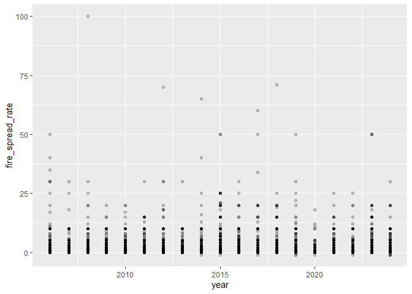
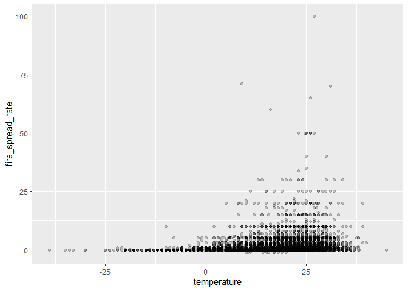
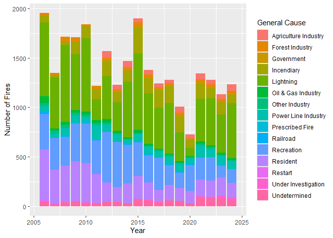
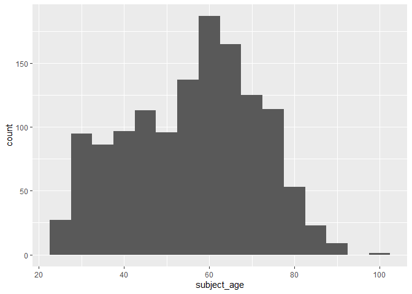
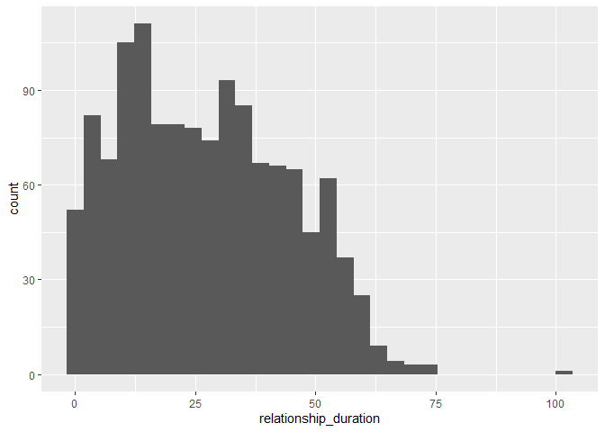
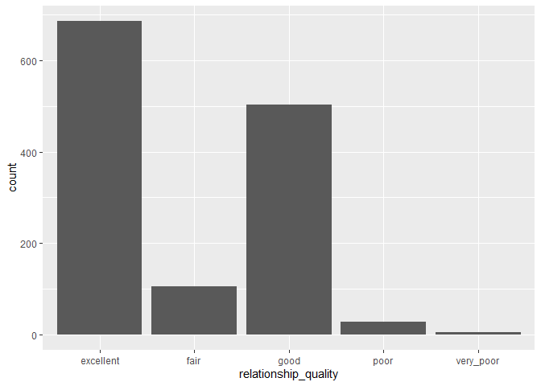

# Mini Data-Analysis: Deliverable 1
Revy Smith

Total points available: 74

# Part 0: Getting Set Up

Let’s get ready to work on this assignment!

**0.1: Install Packages**

- Install the [`diversedata`](https://diverse-data-hub.github.io/)
  package by typing the following into your **R console**:

<!-- -->

    install.packages("pak")
    library(pak)
    pak::pak("diverse-data-hub/diversedata")

**0.2: Load Packages**

Typically, R Packages are loaded in at the very beginning of the
analysis. If you later want to use other packages, please come back and
add them here:

``` r
library(tidyverse)
library(diversedata)
library(moderndive)
#--- Add any other packages below this line ---#
```

# Task 1: Choose a Data Set and Research Question

You may use one of the datasets from class or one of the datasets from
`diversedatahub`.

- **boulder-housing**: This data set contains housing information for
  the Boulder, Colorado area. *\[Add a second sentence here describing
  what the data covers — e.g., the variables included or what question
  it was collected to answer.\]*

- **squirrel-census**: Thes\[[great NYC squirrel
  census](https://www.thesquirrelcensus.com/),`squirrel-data.csv` –
  squirrel sightings recorded around Manhattan and Brooklyn parks.

- **rolling stone**: A [new visual
  essay](https://pudding.cool/2024/03/greatest-music/) from The Pudding
  compares Rolling Stone’s “500 Greatest Albums of All Time” lists from
  2003, 2012, and 2020. A methodology note says the project began with a
  spreadsheet by Chris Eckert and eventually led the authors to develop
  a dataset of their own. Theirs lists every album in the rankings — its
  name, genre, release year, 2003/2012/2020 rank, the artist’s name,
  birth year, gender, and more — plus each year’s voters. \[h/t Jason
  Kottke\]

- **coffee census**: In 2023, [British
  YouTuber](https://www.youtube.com/channel/UCMb0O2CdPBNi-QqPk5T3gsQ)
  (and former [World Barista
  Champion](https://www.jameshoffmann.co.uk/work#/coffee-competitions/))
  James Hoffman virtually hosted the [Great American Coffee Taste
  Test](https://www.youtube.com/watch?v=1fN_z4-EcOU), during which
  thousands of people simultaneously blind-tasted the same four coffees.
  Hoffman has published a [video summarizing the
  results](https://www.youtube.com/watch?v=bMOOQfeloH0), as well as [a
  spreadsheet of anonymized survey
  responses](https://bit.ly/gacttCSV+)from 4,000+ participants. It
  includes tasters’ demographics, general coffee drinking habits and
  preferences, assessments of the four coffees, and more. \[h/t Dan
  Brady\] (via
  [data-is-plural](https://www.data-is-plural.com/archive/2023-11-15-edition/))

- **wildfire**: This data set contains information on wildfires in
  Canada, compiled from official government sources under the Open
  Government Licence – Alberta. The data was gathered to monitor,
  assess, and respond to wildfire risks across different regions.
  Wildfires have far-reaching environmental, social, and economic
  consequences. From an equity and inclusion perspective, analyzing
  wildfire data can reveal geographic and resource-based disparities in
  detection and containment efforts, and highlight how certain
  populations face greater risks due to climate change and limited
  infrastructure. There are 26551 rows and 35 columns.

- **genderassessment**: Collected in 2023, the data allows for
  comparative evaluation across countries, sectors, and ownership types
  (e.g., Public, Private, Government). Each record represents a company
  and its corresponding evaluation across 28 detailed gender related
  indicators, offering a comprehensive snapshot of corporate gender
  equity worldwide. There are 2000 rows and 29 variables

- **hcmst**: This data set is adapted from the original data set [How
  Couples Meet and Stay Together 2017,
  2022](https://data.stanford.edu/hcmst2017). This study, led by
  researchers from Stanford University, surveyed 1,722 U.S. adults in
  2022 to explore how relationships form and change with time and
  focused on dating habits and the impact of the COVID-19 pandemic on
  relationships. This adapted data set focuses on variables that may
  affect the quality of the relationship, considering demographic
  characteristics of the subjects, couple dynamics, as well as
  COVID-19-related variables. The COVID-19 pandemic had a [significant
  impact](https://pmc.ncbi.nlm.nih.gov/articles/PMC10009005/) on
  romantic relationships in the United States. This data set enables
  exploration of how external factors, like the health of the subjects
  and changes in income, as well as personal behaviors, like conflict
  and intimate dynamics, relate to an individual’s perception of the
  quality of the relationship. There are 1328 rows and 21 columns.

- **womensmarchmadness**: This adapted data set contains historical
  records of every NCAA Division I Women’s Basketball Tournament
  appearance since the tournament began in 1982 up until 2018, capturing
  tournament results across more than four decades of collegiate women’s
  basketball. All data is sourced from the NCAA and contains the data
  behind the story [The Rise and Fall Of Women’s NCAA Tournament
  Dynasties](https://fivethirtyeight.com/features/louisiana-tech-was-the-uconn-of-the-80s/).
  The rise in popularity of the NCAA Women’s March Madness, fueled by
  athletes like Caitlin Clark and Paige Bueckers, reflects a broader
  cultural shift in the recognition of women’s sports. Beyond
  entertainment and athletic achievement, women’s participation in sport
  has social and professional benefits. There are 2092 rows and 20
  columns.

*Note: We encourage you to use one of the options above, but if you have
a data set that you’d really like to use, please check with a member of
the teaching team to see whether the data set is of appropriate
complexity. If approved, please add a brief description of the data
here.*

### 1.1: Choose 2 data sets **(2 points)**

Out of the 5 data sets listed above, choose **2** that appeal to you
based on their description. Write your choices below:

<!-------------------------- Start your work below ---------------------------->

1: Write 1st choice here wildfire

2: Write 2nd choice here hcmst

<!----------------------------------------------------------------------------->

### 1.2: Explore the Data **(12 points)**

One way to narrowing down your selection is to *explore* the data sets.
Use your knowledge of `dplyr` to summarize three variables in each of
the data sets (for example, listing what levels of a categorical
variable exist, or calculating the mean of a continuous variable of
interest). Write a sentence that describes your findings for each
variable explored. You may use multiple R code chunks if preferred.

<!-------------------------- Start your work below ---------------------------->

#### Data Set 1

``` r
### Explore 3 variables of data set 1 ###

# variable 1: temperature
wildfire |>
  summarise(mean_temperature = mean(temperature, na.rm = TRUE))
```

    # A tibble: 1 × 1
      mean_temperature
                 <dbl>
    1             17.9

``` r
# variable 2: fire spread rate
wildfire |>
  summarise(mean_spread_rate = mean(fire_spread_rate, na.rm = TRUE))
```

    # A tibble: 1 × 1
      mean_spread_rate
                 <dbl>
    1            0.904

``` r
# variable 3: mean spread rate of each general cause
wildfire |>
  group_by(general_cause) |>
  summarise(mean_spread_rate = mean(fire_spread_rate, na.rm = TRUE))
```

    # A tibble: 15 × 2
       general_cause        mean_spread_rate
       <chr>                           <dbl>
     1 Agriculture Industry            0.577
     2 Forest Industry                 0.314
     3 Government                      0.475
     4 Incendiary                      0.903
     5 Lightning                       1.41 
     6 Oil & Gas Industry              0.893
     7 Other Industry                  0.347
     8 Power Line Industry             0.702
     9 Prescribed Fire                 2.88 
    10 Railroad                        0.670
    11 Recreation                      0.603
    12 Resident                        0.472
    13 Restart                         0.606
    14 Under Investigation             2.22 
    15 Undetermined                    0.848

``` r
# testing graphs of the wildfire data set

# relationship between year and fire spread rate
# have wildfires spread quicker over time?
wildfire |>
  ggplot(aes(x = year, y = fire_spread_rate)) +
  geom_point(alpha = 0.2)
```



``` r
# relationship between temperature and fire spread rate
# does temperature cause wildfires to spread faster?
wildfire |>
  ggplot(aes(x = temperature, y = fire_spread_rate)) +
  geom_point(alpha = 0.2)
```

    Warning: Removed 2872 rows containing missing values or values outside the scale range
    (`geom_point()`).



``` r
# relationship between year and general cause of wildfire
# how has the general cause of wildfire changed over the years
wildfire |>
  ggplot(aes(x = year, fill = general_cause)) +
  geom_bar() +
  labs(
    x = "Year",
    y = "Number of Fires",
    fill = "General Cause"
  )
```



Write your findings here.

The three variables I chose to investigate further were temperature,
spread rate, and general cause. The mean temperature across the entire
data set is around 18, which was lower than I expected. The mean spread
rate across all recorded wildfires is 0.9. I found looking at the mean
spread rate for each general cause to be the most interesting as the
average spread rate for each cause varies noticeably

To get an even better sense of the data, I decided to also create 3
graphs to potentially see what variables I could further explore.

The first two graphs I created were comparing year to fire spread rate
and temperature to fire spread rate. I was surprised that both of those
graphs were not very interesting as I did not notice a clear pattern in
the data. For my third graph, I chose to make a bar plot of the general
cause of recorded wildfires over the years. I am really happy with how
this one turned out as it gives me a great visual representation of the
data in many different ways. I can use this graph not only to see how
the general cause has changed over time, but also how the total number
of recorded wildfires has changed over the years. The first thing I
noticed is the year 2020 stood out as it had a lot fewer recorded
wildfires than every other year. This plot also shows me how the causes
of recorded wildfires have changed over the years as well, for example
recorded wildfires started from residents seem to have decreased over
the years.

#### Data Set 2

``` r
### Explore 3 variables of data set 2 ###

# variable 1: age
hcmst |>
  summarise(mean_age = mean(subject_age, na.rm = TRUE))
```

    # A tibble: 1 × 1
      mean_age
         <dbl>
    1     55.8

``` r
# variable 2: relationship duration
hcmst |>
  summarise(mean_duration = mean(relationship_duration, na.rm = TRUE))
```

    # A tibble: 1 × 1
      mean_duration
              <dbl>
    1          27.2

``` r
# variable 3: mean relationship duration for every category of relationship quality
hcmst |>
  group_by(relationship_quality) |>
  summarise(mean_duration = mean(relationship_duration, na.rm = TRUE))
```

    # A tibble: 5 × 2
      relationship_quality mean_duration
      <chr>                        <dbl>
    1 excellent                     29.5
    2 fair                          20.4
    3 good                          25.8
    4 poor                          22.5
    5 very_poor                     34.5

``` r
# testing graphs of the hcmst data set

# histogram of ages
# what ages are most common among the survey participants?
hcmst |>
  ggplot(aes(x = subject_age)) +
  geom_histogram(binwidth = 5)
```



``` r
#histogram of relationship duration
# how are relationship durations distributed?
hcmst |>
  ggplot(aes(x = relationship_duration)) +
  geom_histogram()
```

    `stat_bin()` using `bins = 30`. Pick better value `binwidth`.

    Warning: Removed 35 rows containing non-finite outside the scale range
    (`stat_bin()`).



``` r
#bar plot of relationship quality
# how do participants rate their relationships?
hcmst |>
  ggplot(aes(x = relationship_quality)) +
  geom_bar()
```



Write your findings here.

The three variables I explored in the hcmst data set were age,
relationship duration, and relationship quality. The mean age across all
participants of this data survey is around 56 years old. The mean
duration of the relationships is around 27. The mean relationship
duration varied across the categories of relationship quality. I found
it interesting that participants who rated their relationships as very
poor had the longest average duration of approximately 34.55 since I
expected it to be the other way around.

I also created some graphs for the hcmst data set. My findings from the
graphs are shown below.

The first data plot I made was a histogram of ages participating in this
data survey. Most people participating in this study seem to be around
60 years old, with an outlier of a participant around 100 years old. The
second plot I made was a histogram of relationship durations. This plot
seems to be right skewed with an outlier at over 100. The third plot I
made was for relationship quality. This plot I found very interesting as
most participants rated their relationship quality as excellent or good,
while a very small portion rated fair, poor, or very poor.

<!----------------------------------------------------------------------------->

### 1.3: Choose 1 Data Set **(2 points)**

It’s time to choose only one data set. State the data set that you’ve
chosen, and why you’ve chosen it.

<!-------------------------- Start your work below ---------------------------->

wildfire

I am choosing wildfire because the last data graph I made (bar graph of
general cause of recorded wildfires over the years) has given me many
ideas of potential questions which I could ask about the data set, and
in general I think it will be very interesting to take a deep look at.

<!----------------------------------------------------------------------------->

### 1.4: Research Question **(4 points)**

Let’s choose a primary and a secondary research question to explore.

Write your research questions **as questions**, and be specific. You can
change it later if needed.

> For example, if I had chosen a `titanic` data set for my project, I
> might ask, “(Primary) Is there a relationship between survival and the
> class of the passengers? (Secondary) Does this relationship differ by
> gender?”

<!-------------------------- Start your work below ---------------------------->

Primary: How did the annual number of recorded wildfires vary by general
cause from 2006 to 2024?

Secondary: Does this relationship differ among fire types (Surface,
Ground, and Crown fires)?

<!----------------------------------------------------------------------------->

### 1.5: Commit **(2 points)**

Commit your work and push it to GitHub. Include an informative commit
message, and include “(1.5)” in the message.

# Task 2: Further Exploring Your Chosen Data Set

### 2.1: Missing Data **(6 points)**

Missing data is inevitable, and can complicate analyses. Let’s see what
variables (if any) have missing data in your chosen data set.

Your task is to create a table that calculates the proportion of missing
values per variable. Be sure to output the table.

<!-------------------------- Start your work below ---------------------------->

``` r
missing_table <- wildfire |>
  mutate_all(as.character) |>
  pivot_longer(
    cols = year:first_ex_size_perimeter,
    names_to = "variable",
    values_to = "value"
  ) |>
  group_by(variable) |>
  summarise(proportion_missing = mean(is.na(value)))

print(missing_table, n = 35)
```

    # A tibble: 35 × 2
       variable                     proportion_missing
       <chr>                                     <dbl>
     1 activity_class                        0        
     2 assessment_hectares                   0        
     3 bucketing_on_fire                     0        
     4 current_size                          0        
     5 detection_agent                       0        
     6 detection_agent_type                  0        
     7 fire_fighting_start_date              0.285    
     8 fire_fighting_start_size              0        
     9 fire_number                           0        
    10 fire_origin                           0        
    11 fire_position_on_slope                0        
    12 fire_spread_rate                      0        
    13 fire_start_date                       0.0261   
    14 fire_type                             0.0000377
    15 first_bh_date                         0        
    16 first_bh_size                         0        
    17 first_ex_size_perimeter               0        
    18 first_uc_date                         0        
    19 first_uc_size                         0        
    20 fuel_type                             0        
    21 general_cause                         0        
    22 ia_access                             0        
    23 ia_arrival_at_fire_date               0.290    
    24 initial_action_by                     0        
    25 latitude                              0        
    26 longitude                             0        
    27 relative_humidity                     0.108    
    28 responsible_group                     0        
    29 size_class                            0        
    30 temperature                           0.108    
    31 true_cause                            0        
    32 weather_conditions_over_fire          0        
    33 wind_direction                        0        
    34 wind_speed                            0.108    
    35 year                                  0        

<!----------------------------------------------------------------------------->

### 2.2: Missing Data (Again) **(6 points)**

Based on your research question, will this missingness pose an issue?
For the purposes of this class (and this class only!), we will consider
missingness a problem **if there is more than 20% of a single variable
(that is of interest) is missing**.

> For example, let’s assume I wanted to explore the following research
> questions: “Is there a relationship between survival and the class of
> the passengers? Does this relationship vary by gender?”. If the
> variable indicating whether or not a person survived was missing for
> 20% or more of the passengers, then this would be a problem. However,
> if a variable indicating the colour of shirt a passenger was wearing
> was missing, this probably wouldn’t be an issue as that variable is
> quite irrelevant to my analysis!

Based on this definition, is missingness an issue for your analysis? If
so, describe how you will address this (pivoting your research question,
for example). If you will continue with a new research question, write
it here! **Do not go back to Task 1 and redo the analysis.** ).

If missingness is not an issue, describe why.

<!-------------------------- Start your work below ---------------------------->

For my specific research questions, missingness will not pose an issue.
The variables year and general_cause both have no missing values. The
variable fire_type is only missing one value, which is 0.00377% of the
data. Since it is below 20%, missingness will not pose an issue.

<!----------------------------------------------------------------------------->

### 2.3: Tidy your Data **(10 points)**

Produce a tidy data set that could be used to answer your research
questions. **Please ensure you have at least one quantitative (numeric)
and one categorical variable in your data set. It’s okay you need to
include a less relevant variable in your tidied data to ensure this.**

To tidy your data, you should:

- Create new variables (if needed)

- Transform the data into a tidy form (if needed)

- Remove irrelevant columns (if needed)

- Comment your code throughout

Show the first 6 rows of the tidied data.

<!-------------------------- Start your work below ---------------------------->

``` r
wildfire_tidy <- wildfire |>
  # select only the variables needed for my research questions
  select(year, general_cause, fire_type)

# displays only 6 rows
print(wildfire_tidy, n = 6)
```

    # A tibble: 26,551 × 3
       year general_cause  fire_type
      <dbl> <chr>          <chr>    
    1  2006 Resident       Surface  
    2  2006 Incendiary     Surface  
    3  2006 Incendiary     Surface  
    4  2006 Incendiary     Surface  
    5  2006 Other Industry Surface  
    6  2006 Resident       Surface  
    # ℹ 26,545 more rows

<!----------------------------------------------------------------------------->

### 2.4: Create a Table (10 points)

Use any functions from the `tidyverse` to create one table that outputs
the mean, minimum, and maximum of all numeric columns in your data,
dropping the missing values if they exist.

Show the outputted table.

<!-------------------------- Start your work below ---------------------------->

``` r
wildfire_tidy |>
  summarise(
    mean_year = mean(year, na.rm = TRUE),
    min_year = min(year, na.rm = TRUE),
    max_year = max(year, na.rm = TRUE)
  )
```

    # A tibble: 1 × 3
      mean_year min_year max_year
          <dbl>    <dbl>    <dbl>
    1     2014.     2006     2024

<!----------------------------------------------------------------------------->

### 2.5: Commit **(2 points)**

Commit your work and push it to GitHub. , and include “(2.7)” in the
message.

# Task 3: Tidy Your Submission Overall

Check over your document and GitHub repository for the following:

### 3.1: Coherence **(2 points)**

The document should read sensibly from top to bottom, with no major
continuity errors. An example of a major continuity error is having a
data set listed for Task 3 that is not part of one of the data sets
listed in Task 1.

### 3.2: Error-free code **(2 points)**

For full marks, all code in the document should run without error and be
completely reproducible.

### 3.3 README **(6 points)**

There should be a file named `README.md` at the top level of your
repository. Its contents should automatically appear when you visit the
repository on GitHub.

Minimum contents of the README file:

- In a sentence or two, explains what this repository is, so that
  future-you or someone else stumbling on your repository can be
  oriented to the repository.
- List the files/folders contained in the repository
- In a sentence or two, briefly explains how to engage with the
  repository. You can assume the person reading knows the material from
  STAT 545A. Basically, if a visitor to your repository wants to explore
  your project, what should they know? How can they reproduce your
  report?

### 3.4 Generative AI Disclosure **(3 points)**

In this course, Generative AI can be used in the following ways:

- to clarify concepts discussed in class

- as an “advanced search engine” (i.e., searching error codes)

- debugging code that students wrote and attempted to debug on their own

Generative AI **CANNOT** be used to generate text or code (including
comments) from scratch.

Any use of Generative AI must be disclosed.

**To disclose your use, please copy and paste the following template
into the README of your GitHub Repository and fill out the relevant
details** \[in square brackets\]. BE SPECIFIC. Saying you used it to
debug your code is not enough. Explicitly describe where you got stuck

Here is an example of a specific, explicit debug:

> “I had the error `attempt to apply non-function` after running my
> code. I used Claude to help me identify that this error was due to me
> attempting to multiply two numbers together without the use of a `*`,
> i.e. `(2)(3)` instead of `2*3`.”

``` markdown

## Generative AI Statement

Generative AI (through [LIST MODELS USED, i.e. ChatGPT, CoPilot)] was used to
help me complete  this assignment in the following ways.

1. [Describe here]

2. [Describe here]

...

I affirm that Generative AI was not used to generate text, code, or comments for
my assessments.
```

If you did not use Generative AI, please include the following in your
README:

``` markdown

## Generative AI Statement

Generative AI was not used in any way throughout this assignment.
```

Assessments suspected of having AI-generated text and/or code, or
assignments where the Generative AI use was not disclosed, will be
flagged and temporarily assigned a grade of zero. Students will be
required to meet with the instructor to receive a grade.

### 3.5 Output **(4 points)**

All output on GitHub is readable, recent and relevant:

- All `.qmd` files have been rendered to their output `.md` files.
- All rendered `.md` files are viewable without errors on Github.
  Examples of errors: Missing plots, “Sorry about that, but we can’t
  show files that are this big right now” messages, error messages from
  broken R code
- All of these output files are up-to-date – that is, they haven’t
  fallen behind after the source (`.qmd`) files have been updated.
- There should be no relic output files. For example, if you were
  rendering a `.qmd` to `.html`, but then changed the output to be only
  a markdown file, then the `.html` file is a relic and should be
  deleted.

# Step 4: Submission

\*\* Submit repo link \*\*

To submit this milestone, submit the github link to the repo.

This assignment was authored by the team of instructors at University of
British Colombia’s STA 545 class.
